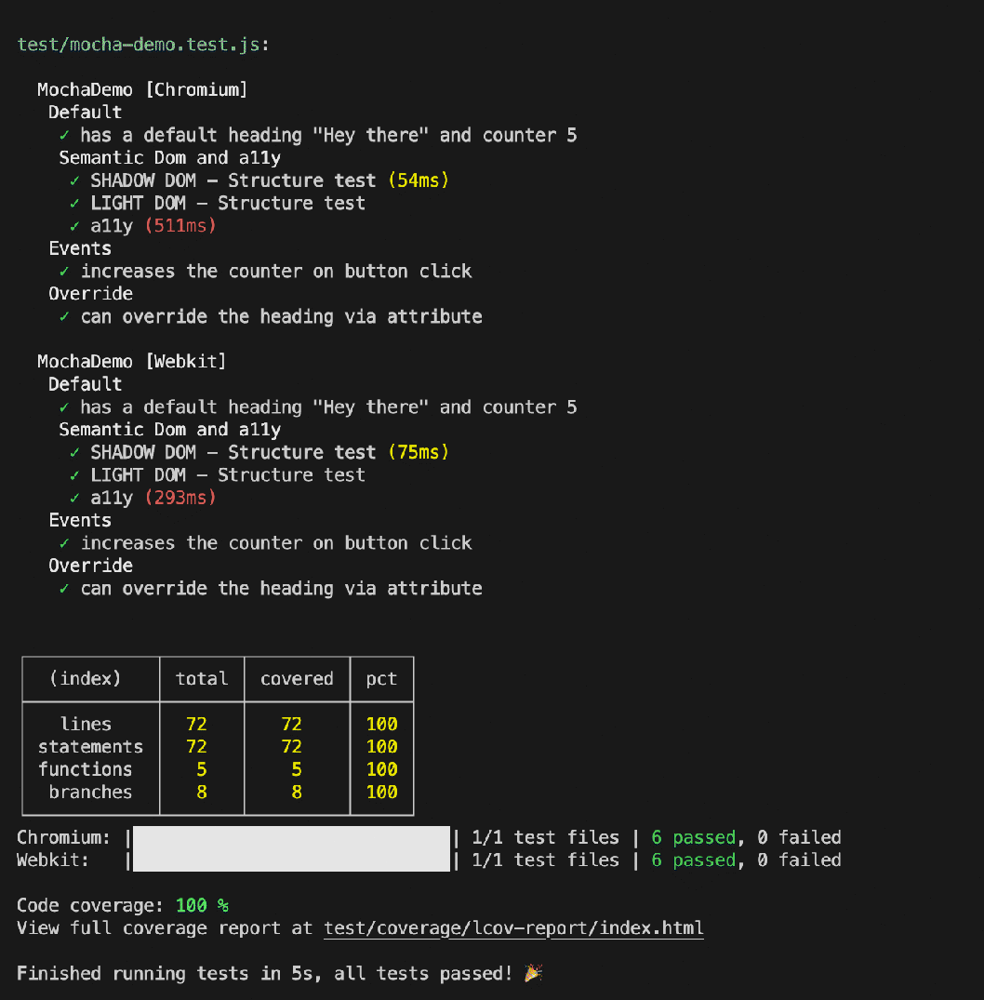

# Mocha-style reporter for Test Runner API


## Install package
```js
npm install @blockquote/test-runner-mocha-style-reporter --save-dev
```

## web-test-runner.config.mjs

```js
import { defaultReporter } from '@web/test-runner';
import { mochaStyleReporter } from '@blockquote/test-runner-mocha-style-reporter';

...
  reporters: [
      defaultReporter(),
      mochaStyleReporter(),
  ],
...

```

### Reporters: Overview
By default, the reporter will report both test results and test coverage. You can disable these reports by passing options to the mochaStyleReporter() function:

```js
import { defaultReporter } from '@web/test-runner';
import { mochaStyleReporter } from '@blockquote/test-runner-mocha-style-reporter';

...
  reporters: [
      defaultReporter(),
      mochaStyleReporter({ reportResults: true, reportCoverage: true }),
  ],
...

```

<hr>


## Reporter for web test runner

See [moder-web website](https://modern-web.dev/docs/test-runner/reporters/write-your-own/) for full documentation.


